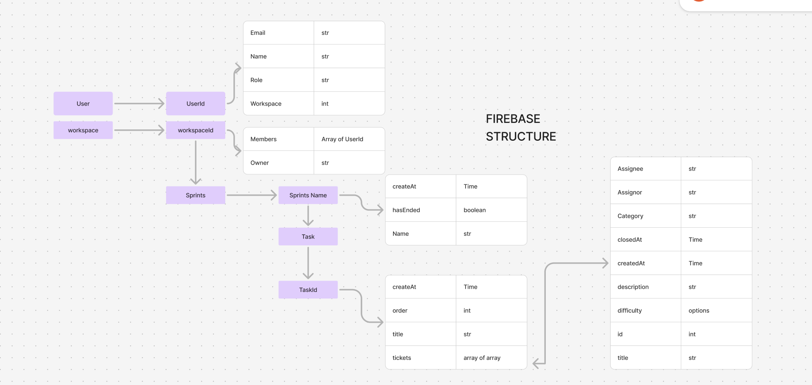

# Treeva

This repository is a task management and visualization app designed to enhance productivity and team collaboration with a unique 3D tree representation of sprint progress. With features like dark and light modes, Firebase integration, detailed user profiles, team analytics, and task management, this app provides an engaging and intuitive way to manage projects.

## Features

- **3D Tree Visualization**: Sprint tasks are visualized as trees on an island, providing a fun and interactive way to track progress. Each tree stage reflects the percentage of completed tasks, giving a visual snapshot of sprint health.
- **Interactive Dark/Light Modes**: Customize the appearance of the app with a toggle between dark and light modes, ensuring a comfortable user experience.
- **User Profile and Progress Tracking**: Displays user information, team members, and an animated progress circle based on closed tickets, helping users track their individual contributions.
- **Team Collaboration and Analytics**: Track progress per sprint with a breakdown of tickets assigned to each team member. Detailed statistics and charts help teams understand performance over time.
- **Firebase Integration**: Real-time data storage and retrieval using Firebase Firestore for managing users, tasks, and sprints. All data is securely stored and accessible across devices.
- **Responsive and Mobile-Friendly Design**: Adaptable for both desktop and mobile environments, ensuring that team members can stay updated on the go.
- **Task Management with Ticket System**: Add, edit, and delete tasks within sprints. Each task includes tickets that can be assigned, reassigned, and marked as completed.
- **Dynamic Task Categories and Difficulties**: Supports categorizing tasks and assigning difficulty levels, allowing teams to prioritize work effectively.
- **Intuitive User Interface**: Includes animated elements, smooth transitions, and tooltips for an improved user experience, making project management both functional and visually appealing.

## Project Structure

- **`Homepage`**: The main entry point, rendering the side navigation, user profile, and 3D visualizations.
- **`IslandScene`**: Renders the 3D scene with trees using @react-three/fiber, representing each sprint’s progress as stages of a tree. By selecting the tree you can view analytics of the sprint.
- **`Task Management`**: Add, edit, and delete tasks within sprints. Each task column is styled to be responsive and intuitive, providing quick access to task details.
- **`Analytics`**: Visualizes sprint progress with charts, tracking open and closed tickets over time. This helps teams quickly identify trends and areas for improvement.

## Getting Started

1. **Tree Visualization**: Click on a tree to focus on its progress in the sprint. Hover over trees to see sprint names, representing the tasks completed in that sprint.
2. **Add New Task**: Click the "Add Task" button in each sprint column to quickly create and assign new tasks.
3. **Switch Themes**: Toggle between light and dark modes using the button in the sidebar to suit your preference.
4. **Track Analytics**: View detailed ticket stats for each sprint, including team member progress, tickets closed, and completion percentage.

## Code Overview

### Key Components

1. **`Homepage`**:
   - Manages active views, allowing users to switch between the User Profile, Sprints, and 3D Visualization.
   - Retrieves and displays user and workspace data from Firebase Firestore.

2. **`IslandScene`**:
   - Renders the 3D tree visualization for sprints, with animations and camera movement based on user interactions.
   - Each tree stage is represented by a unique GLTF model, allowing for visually distinct stages of progress.

3. **`Analytics`**:
   - Uses Victory charts to render ticket stats, providing insights into sprint progress and individual contributions.
   - Displays member stats with ticket assignments and closures, giving teams a clear view of each member's productivity.

4. **`UserProfile`**:
   - Shows detailed user information, lists team members, and displays a progress circle with color-coded indicators for completion percentage.

### Styles and Themes

The CSS files include styles for both dark and light modes, integrated into the `Homepage` component. Color variables are defined to keep a consistent look across the app, ensuring a seamless experience when switching themes.

### Firebase Structure

- **Users**: Stores user profile information, including personal details and contact information.
- **Workspaces**: Contains workspace-level data, including sprints, tasks, and team members. Holds task data, each containing a series of tickets for more granular tracking.

### Customization

- **3D Models**: Replace tree models in the `public/` directory to change the appearance of each sprint stage.
- **Styling**: Modify CSS variables in `Task.css` to customize colors, layouts, and animations.
- **Firebase Data Structure**: Extend the current Firebase structure to include additional fields, such as task comments, attachments, or custom statuses.

## Dependencies

- **React**: Frontend framework for building a responsive, interactive UI.
- **@react-three/fiber**: Integrates Three.js with React for the 3D tree visualizations.
- **Firebase API**: Real-time database and authentication for storing and managing project data, allowing teams to collaborate and update tasks in real time. 
- **Victory**: Charting library for rendering analytics, making it easy to track sprint progress and visualize team statistics.

## Future Improvements

- **Task Comments and Attachments**: Allow team members to add comments and attach files to tasks, enhancing collaboration and detail-sharing.
- **Enhanced User Roles and Permissions**: Add user roles such as Admin, Member, and Viewer, each with specific permissions for creating, editing, or viewing tasks.
- **Notifications and Reminders**: Implement a notification system for upcoming deadlines and reminders for incomplete tasks.
- **Enhanced Analytics**: Add more detailed charts and graphs, such as individual performance analytics, sprint overviews, and burndown charts.
- **Integrations with Other Platforms**: Support integrations with popular platforms like Slack, Trello, and Google Calendar for cross-platform synchronization.
- **AI-Powered Task Recommendations**: Use machine learning to analyze user productivity and suggest task prioritization or workflow improvements.